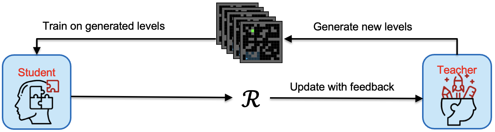

# Generalization through Diversity: Improving Unsupervised Environment Design

  

  <h3 align="center">WenjunLi, PradeepVarakantham, DexunLi</h3>

  

    Singapore Management University
     
    IJCAI-2023
     
    <a href="https://www.ijcai.org/proceedings/2023/0601.pdf">[Paper]</a>
    ·
    <a href="https://github.com/wenjunli-0/diplr_webpage/">[Codes]</a>
  

## Introduction
- [Quick start](#quick-start)
- [Status](#status)
- [What's included](#whats-included)
- [Bugs and feature requests](#bugs-and-feature-requests)
- [Contributing](#contributing)
- [Creators](#creators)
- [Thanks](#thanks)
- [Copyright and license](#copyright-and-license)

## Background
To train generalizable RL agents, researchers recently proposed the Unsupervised Environment Design (UED), which formulates a teacher-student framework, where the teacher creates numerous environments to train the student so that the student will be robust to unseen scenarios. UED aims to find out what are the best training environments given the student current policy.  

## Method
Some text

- Instruction 1
- Instruction 2
- Instruction 3

## Experiment Resutls
Here goes all the budgets

## Acknowledgement
This research/project is supported by the National Research Foundation Singapore and DSO National Laboratories under the AI Singapore Programme (AISG Award No: AISG2-RP- 2020-017).

