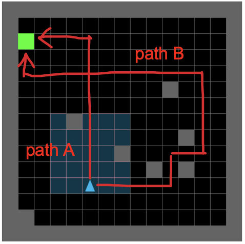
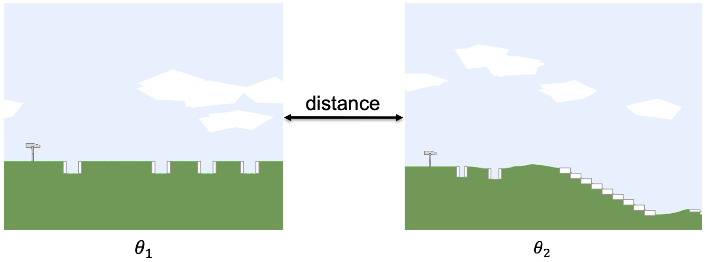
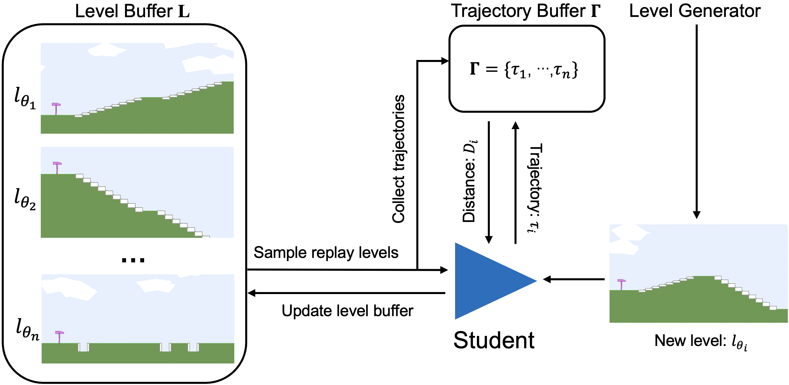

# Generalization through Diversity: Improving Unsupervised Environment Design, IJCAI-2023

  <h3 align="center">WenjunLi, PradeepVarakantham, DexunLi</h3>
  

    Singapore Management University
     
    <a href="https://www.ijcai.org/proceedings/2023/0601.pdf">[Paper]</a>
    ·
    <a href="https://github.com/wenjunli-0/diplr_webpage/">[Codes]</a>
  

## Introduction
Agent decision-making using Reinforcement Learning (RL) heavily relies on either a model or simulator of the environment (e.g., moving in an 8x8 maze with three rooms, or playing Chess on an 8x8 board). Due to this dependence, small changes in the environment (e.g., positions of obstacles in the maze, size of the board) can severely affect the effectiveness of the policy learned by the agent. To that end, existing work has proposed the Unsupervised Environment Design (UED) framework to train RL agents on an adaptive curriculum of environments (generated automatically) to improve performance on out-of-distribution (OOD) test scenarios. Specifically, existing research in UED has employed the potential for the agent to learn in an environment (captured using *regret*) as the key factor in selecting the next environment(s) to train the agent. However, such a mechanism can select similar environments (with a high potential to learn) thereby making agent training redundant in all but one of those environments. To that end, we provide a principled approach to adaptively identify diverse environments based on a novel distance measure relevant to environment design. We empirically demonstrate the versatility and effectiveness of our method in comparison to multiple leading approaches for unsupervised environment design on three distinct benchmark problems used in literature.

## Background
#### Unsupervised Environment Design, UED
To train generalizable RL agents, researchers recently proposed the Unsupervised Environment Design (UED), which formulates a teacher-student framework, where the teacher creates numerous environments to train the student so that the student will be robust to unseen scenarios. UED aims to find out what are the best training environments given the student's current policy.  

#### Regret
The leading algorithms in UED all rely on the *regret* notion, which is defined as the difference between the agent's optimal performance and current actual performance. The pioneering paper in UED, PAIRED[1], rollouts the agent policy in the environment (denoted by $\theta$) and collect multiple trajectories. The regret is approximated as the difference between the maximum return and the average return.  
$$regret^{\theta}(\pi) \approx \max_{\tau \sim \pi} V^{\theta}(\tau) - \mathbb{E}_{\tau \sim \pi} V^{\theta}(\tau)$$

The teacher agent in UED will iteratively generate[1] or replay[2] high-regret environments, and the student agent will learn in the environments provided by the teacher. 

## Method
Although the algorithms in UED have improved the agent's generalization performance significantly by utilizing regret. However, to generalize better, it is not sufficient to train the agent only on high-regret/GAE levels. We can have multiple high-regret levels, which are very “similar” to each other and the agent does not learn a lot from being trained on similar levels. Thus, levels also have to be sufficiently “different”, so that the agent can gain more perspective on different challenges that it can face.

#### Distance between Environments
We quantify the environment diversity by comparing it to other environments. 

#### Trajectory Distance
We quantify the environment diversity by comparing it to other environments. 

#### Diversity Induced Prioritied Level Replay, DIPLR
We build our algorithm, DIPLR. 

## Experiment Results
Results on three highly distinct benchmark domains. 

- Minigrid
- Bipedal-Walker
- Car-Racing

## Acknowledgement
This research/project is supported by the National Research Foundation Singapore and DSO National Laboratories under the AI Singapore Programme (AISG Award No: AISG2-RP- 2020-017).

## Reference

- [1] [Emergent Complexity and Zero-shot Transfer via Unsupervised Environment Design](https://arxiv.org/abs/2012.02096)
- [2] [Prioritized Level Replay](https://arxiv.org/abs/2010.03934)
