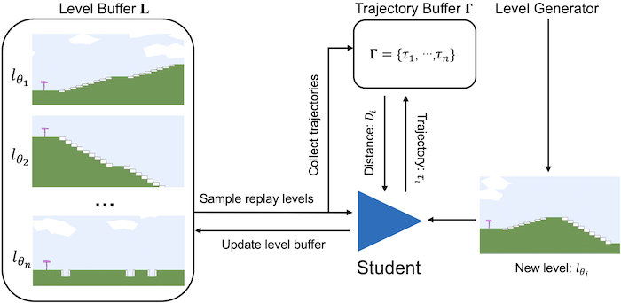
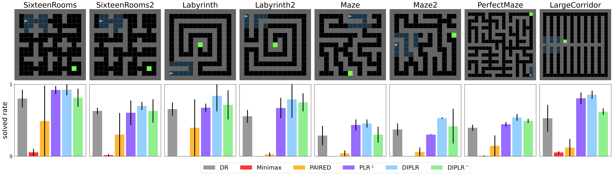

# Generalization through Diversity: Improving Unsupervised Environment Design, IJCAI-2023

  <h3 align="center">Wenjun Li, Pradeep Varakantham, Dexun Li</h3>
  

    Singapore Management University
     
    <a href="https://www.ijcai.org/proceedings/2023/0601.pdf">[Paper]</a>
    ·
    <a href="https://github.com/wenjunli-0/diplr_webpage/">[Codes]</a>
    
  

## 1. Introduction
Agent decision-making using Reinforcement Learning (RL) heavily relies on either a model or simulator of the environment (e.g., moving in an 8x8 maze with three rooms, or playing Chess on an 8x8 board). Due to this dependence, small changes in the environment (e.g., positions of obstacles in the maze, size of the board) can severely affect the effectiveness of the policy learned by the agent. To that end, existing work has proposed the Unsupervised Environment Design (UED) framework to train RL agents on an adaptive curriculum of environments (generated automatically) to improve performance on out-of-distribution (OOD) test scenarios. Specifically, existing research in UED has employed the potential for the agent to learn in an environment (captured using *regret*) as the key factor in selecting the next environment(s) to train the agent. However, such a mechanism can select similar environments (with a high potential to learn) thereby making agent training redundant in all but one of those environments. To that end, we provide a principled approach to adaptively identify diverse environments based on a novel distance measure relevant to environment design. We empirically demonstrate the versatility and effectiveness of our method in comparison to multiple leading approaches for unsupervised environment design on three distinct benchmark problems used in literature.

## 2. Background
### 2.1 Unsupervised Environment Design, UED
To train generalizable RL agents, researchers recently proposed the Unsupervised Environment Design (UED), which formulates a teacher-student framework. In UED, the teacher creates numerous environments to train the student so that the student will be robust to unseen scenarios. The teacher takes the feedback from student to create environments that are adaptive to the student's current ability level. The teacher's objective is to improve the student's generalization performance across a variety of scenarios, including unseen scenarios. 

### 2.2 Regret
The leading algorithms in UED all rely on the *regret* notion, which is defined as the difference between the student's optimal performance and current actual performance. The pioneering paper, PAIRED[1], rollouts the student policy in the environment (denoted by $\theta$) and collect multiple trajectories. The regret is approximated as the difference between the maximum return and the average return.  
$$regret^{\theta}(\pi) \approx \max_{\tau \sim \pi} V^{\theta}(\tau) - \mathbb{E}_{\tau \sim \pi} V^{\theta}(\tau)$$

  
An illustration is provided in the above figure. In this maze, the optimal path is A and the student's actual path is B. We can use path A and path B to calculate the regret. In such a way, we collect environments and their associated regrets, and use them to train the teacher to create high-regret environments. By iteratively learning on high-regret environments, the student gradually accumulates experiences and generalizes to various scenarios. 

## 3. Method
UED algorithms have improved the student's generalization performance significantly by utilizing regret. However, to generalize better, it is not sufficient to train the student only in high-regret environments. We can have multiple high-regret environments, that are very “similar” to each other and the student does not learn a lot from being trained in similar environments. Thus, environments also have to be sufficiently “different”, so that the student can gain more perspective on different challenges that it can face.

To that end, in this paper, we introduce a diversity metric in UED, which is defined based on the distance between occupancy distributions associated with student trajectories from different environments. We then provide a principled method, referred to as **Diversity Induced Prioritized Level Replay** (DIPLR), to select environments with the diversity metric to provide better generalization performance than the state-of-the-art.

### 3.1 Distance between Environments
Assume we want to calculate the distance between two environments, denoted by $\theta_1$ and $\theta_2$. One potential option is to encode each environment using one of a variety of encoding methods (e.g., Variational Autoencoder) or using the parameters associated with the environment and then taking the distance between encodings of environments. However, such an approach has multiple major issues.  

- Encoding a environment does not account for the sequential moves the student agent will make through the environment, which is of critical importance as the similarity is with respect to student policy.
- There can be stochasticity in the environment that is not captured by the parameters of the environment. For instance, the Bipedal-Walker domain has multiple free parameters controlling the terrain. Because of the existence of stochasticity in the environment generation process, two environments could be very different while we have near-zero distance measurement given their environment parameter vectors.
- Distance between environment parameters requires normalization in each parameter dimension and is domain-specific.

Since we collect several trajectories within current environments when approximating the regret value, we can naturally get the state-action distributions induced by the current policy. Therefore, we propose to evaluate ***similarity on the different environments based on the distance between occupancy distributions of the current student policy***. The hypothesis is that if the environments are similar, then the trajectories traversed by the student agent within the environment will have similar state-action distribution.  

We employ the Wasserstein distance described to calculate the distance between two distributions from empirical samples.

### 3.2 Diversity Induced Prioritied Level Replay, DIPLR
Our algorithm maintains a buffer of high-potential environments for training. At each iteration, we either: (a) generate a new environment to be added to the buffer; or (b) sample a mini-batch of environments for the student agent to train on. To increase the diversity of the environment buffer, we add new environments to the buffer that have the highest value of this distance. Instead of solely considering the diversity aspect of the environment buffer[2], we can also take learning potential into account by using regrets so that we will have an environment buffer that is not only filled up with diverse training environments but also challenging environments that continuously push the student. An overview of our proposed algorithm is presented below.  

## 4. Experiment Results
We empirically demonstrate the versatility and effectiveness of DIPLR in comparison to leading UED algorithms on three highly distinct benchmark domains. In short, DIPLR outperforms the exsiting baselines in all testing scenarios. For each domain, we provide the students' detailed performance on a variety of testing environments as well as the standardized interquartile mean (IQM) and optimality gap (OG) plots[3]. 

### 4.1 Minigrid
Minigrid is a good benchmark due to its easy interpretability and customizability. In our experimental settings, the teacher has a maximum budget of 60 block cells and can place the start position and goal position elsewhere. The student is required to navigate to the goal cell within 256 steps and it receives rewards=(num-steps/256) upon success, otherwise, it receives zero rewards. 

After training the students with various UED algorithms until convergence, we evaluate them on "out-of-distribution" (OOD) testing environments, i.e., the mazes created by humans. The below figure provides the zero-shot transfer performance in eight human-designed test environments. The plots are based on the median and interquartile range of solved rates across 10 independent experiments.  
  

The below figure presents the aggregate test performance in Minigrid Domain across 10 independent runs. Higher IQM scores and lower optimality gap are better.  
  

### 4.2 Bipedal-Walker
We also conduct empirical study on Bipedal-Walker domain, which is popular in the community as it is a well-parameterized environment with eight variables (including ground roughness, the number of stair steps, min/max range of pit gap width, min/max range of stump height, and min/max range of stair height) conditioning the terrains. The teacher in Bipedal-Walker can specify the values of the eight environment parameters, but there will still be stochasticity in the generation of a particular level. As for the student, i.e., walker agent, it should determine the torques applied on its joints and is constrained by partial observability where it only knows its horizontal speed, vertical speed, angular speed, positions of joints, joints’ angular speed, etc. Six examples of test environments in Bipedal-Walker do- main. (a) BipedalWalker, (b) Hardcore, (c) Stair, (d) PitGap, (e) Stump, (f) Roughness. Note that these may not be the exact test en- vironment terrains but only extreme cases for demonstration.  
  

Various student's evaluation performance on the six test environments during the training period over five independent experiments (mean and standard error) is presented below.  
  

The below figure provides the aggregate test performance over 10 runs in Bipedal- Walker domain. Higher IQM scores and lower optimality gap are better.  
  

### 4.3 Car-Racing
To validate that our method is scalable and versatile, we further implement DIPLR on the Car-Racing environment. In this domain, the teacher needs to create challenging racing tracks by using Bezier curves (via 12 control points) and the student drives on the track under continuous control with dense reward. A zoom-in illustration of the track is shown in the below figure (a). After training the students, we evaluate them in four test scenarios, among which three challenging F1-tracks existing in the real world and the other one is a basic vanilla track. Note that these tracks are absolutely OOD because they cannot be defined with just 12 control points, for example, the F1-Singapore track in the below figure (c) has more than 20 control points.  
  

Various student's evaluation performance on the four zero-Shot test environments during training period over five independent experiments (mean and standard error) is presented below.  
  

The below figure presents the aggregate test performance over 10 independent runs in Car-Racing domain.  
  

## Acknowledgement
This research/project is supported by the National Research Foundation Singapore and DSO National Laboratories under the AI Singapore Programme (AISG Award No: AISG2-RP- 2020-017).

## Reference

- [1] [Emergent Complexity and Zero-shot Transfer via Unsupervised Environment Design](https://arxiv.org/abs/2012.02096)
- [2] [Prioritized Level Replay](https://arxiv.org/abs/2010.03934)
- [3] [Deep Reinforcement Learning at the Edge of the Statistical Precipice](https://arxiv.org/abs/2108.13264)

